# Capacitor Contacts App

This app has been tested on:
- IOS emulator
- IOS physical device
- Android emulator

## Requirements

The task is to create an Android or iOS app with which the contacts on the device can be managed.

### General

-   [x] The app supports at least one of the two platforms Android or iOS.
-   [x] All required permissions must be requested from the app.

### Home screen

-   [x] There is a list view that lists all contacts already stored on the device.
-   [x] The contacts are sorted by first name in the list view.

### Detail view

-   [x] There is a detailed view that shows at least the following information of a contact: first name, last name, phone number, e-mail address and birthday.
-   [x] The detailed view has a button to return to the list view.
-   [x] Each phone number can be opened in the standard phone app or copied to the clipboard.
-   [x] Each e-mail address can be opened in the standard e-mail app or copied to the clipboard.
-   [x] Contacts can be deleted via the detail view.
-   [x] The deletion of a contact must be confirmed by the user via a dialogue.

### Insert View

-   [x] There is an insert view that is used to add new contacts.
-   [x] The insert view has at least the following input fields: First Name, surname, telephone number, e-mail address and birthday.
-   [x] The insert view has two buttons for cancelling and saving the entry.

## Functions

-   The **Home screen** shows all contacts from the device. All contacts are grouped and sorted by the first name. If no contact can be found you will see an empty screen.
-   Use the **search bar** to search for a specific contact. The contacts will be searched by containing string.
-   Pull the screen down to fetch the data again. 
    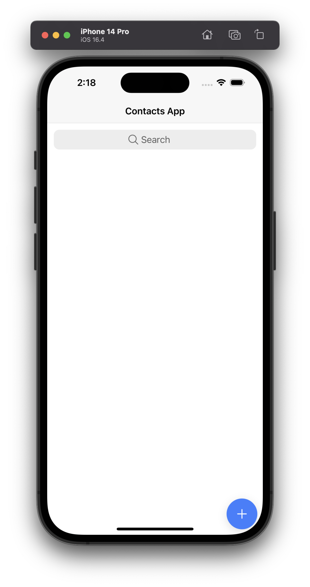
    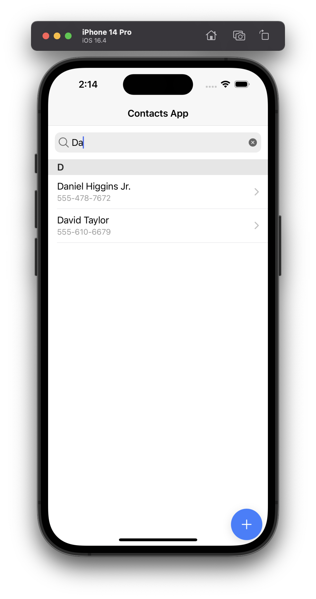 
-   If the app has no permission to access the contacts you will be prompted with the following error message. By clicking the **Open Settings** button you will be directed to the app settings. Here you can grant access to the app. 
    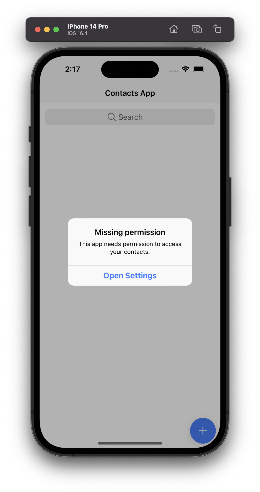
    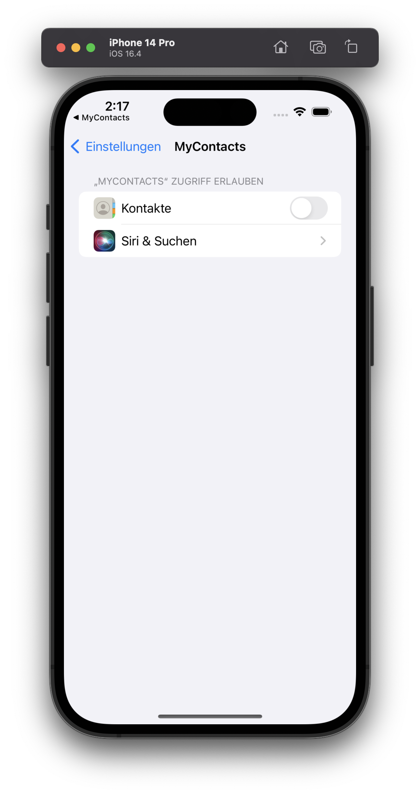 
-   The **Insert view** is used to add new contacts you can access it by clicking the button in the lower right corner of the home screen. The following fields are required: First Name, Last Name, Phone Number, Phone Number Type, E-Mail Address, E-Mail Address Type and Birthday. To save the new contact you have to fill all the fields. The back button will discard all changes and navigate back to the home screen. 
    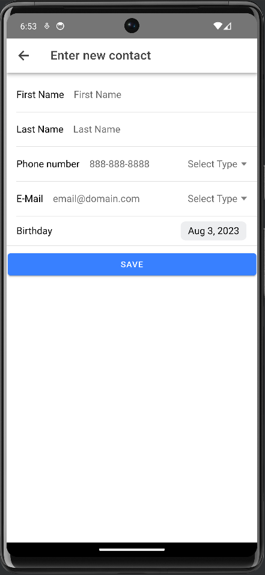 
-   To access the **details page** select a contact on the home screen. Here you can see all the information available about this contact. 
    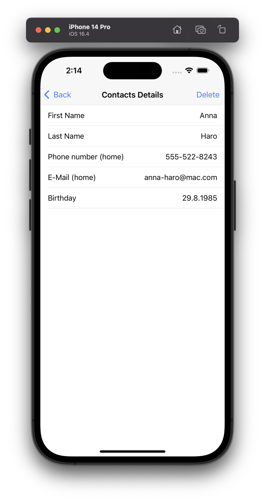 
-   Slide the Phone Number or E-Mail Address to the left to call the number/write an E-Mail 
    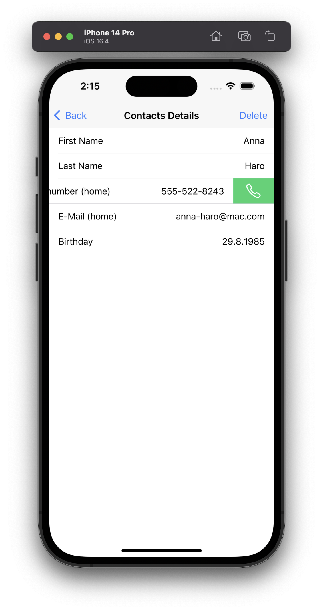
    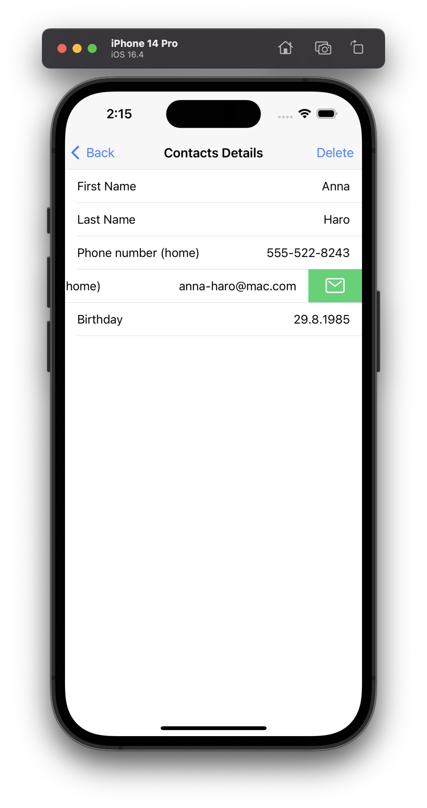
-   Slide the Phone Number or E-Mail Address to the right to copy the number/address to the clipboard 
    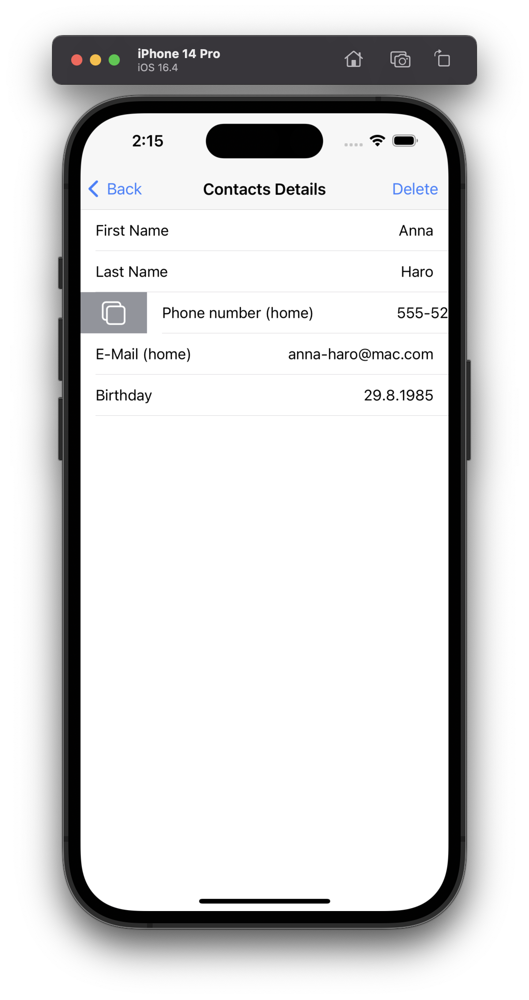
    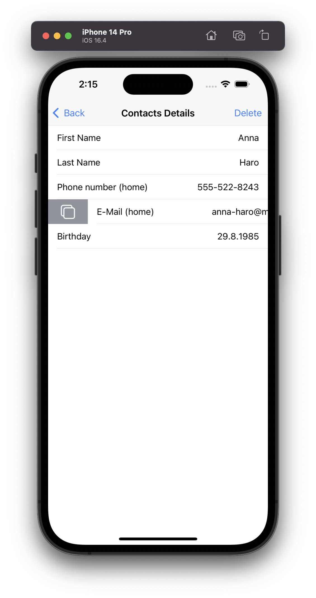 
-   To delete a contact click on the **Delete** button in the top right corner. You will be prompted with a confirmation dialog. Clicking **Yes** will delete the contact and navigate back to the home screen. Clicking **No** will close the dialog. 
    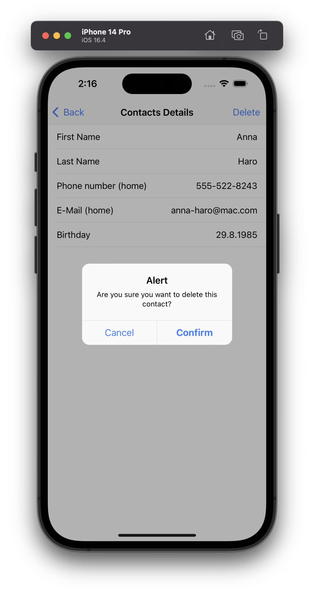
     
