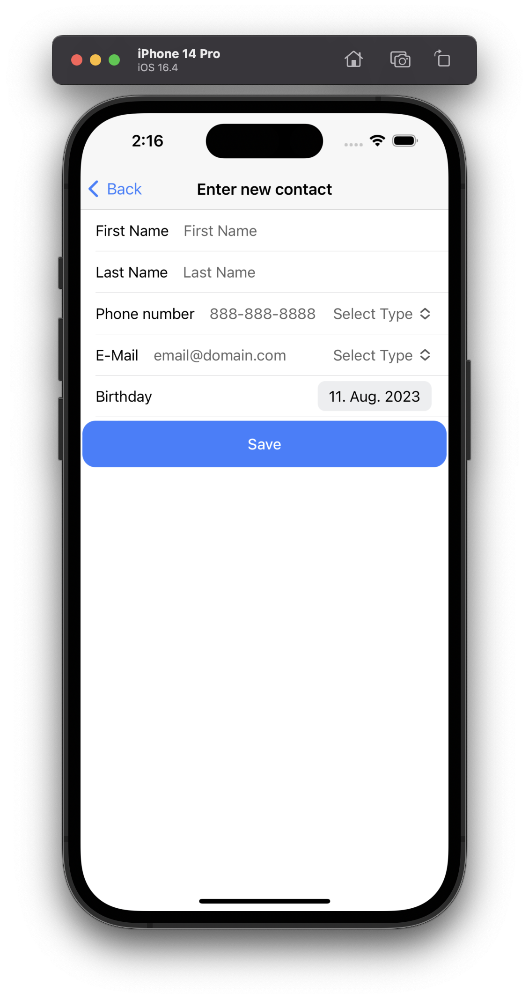

# Capacitor Contacts App

## Requirements

The task is to create an Android or iOS app with which the contacts on the device can be managed.

### General

-   [x] The app supports at least one of the two platforms Android or iOS.
-   [x] All required permissions must be requested from the app.

### Home screen

-   [x] There is a list view that lists all contacts already stored on the device.
-   [x] The contacts are sorted by first name in the list view.

### Detail view

-   [x] There is a detailed view that shows at least the following information of a contact: first name, last name, phone number, e-mail address and birthday.
-   [x] The detailed view has a button to return to the list view.
-   [x] Each phone number can be opened in the standard phone app or copied to the clipboard.
-   [x] Each e-mail address can be opened in the standard e-mail app or copied to the clipboard.
-   [x] Contacts can be deleted via the detail view.
-   [x] The deletion of a contact must be confirmed by the user via a dialogue.

### Insert View

-   [x] There is an insert view that is used to add new contacts.
-   [x] The insert view has at least the following input fields: First Name, surname, telephone number, e-mail address and birthday.
-   [x] The insert view has two buttons for cancelling and saving the entry.

## TODO

-   [ ] Overall testing of the app
-   [ ] Test _Contacts.requestPermissions()_ in _getContacts()_ function

## Functions

-   The **Home screen** shows all contacts from the device   All contacts are grouped and sorted by the first name  Pull the screen down to refresh data on the Home screen and the Details page 
    
     
-   The **Details page** shows the first name, last name, all phone numbers, all mail addresses and the birthday  Slide the phone numbers and mail addresses to the right to copy them to the clipboard and to the left to call the number/ send a message to the mail Click the button in the upper right corner to delete the contact and beeing redirected to the home screen 
    
    
     
-   Click the button in the right lower corner to create a new contact You have to fill in **all** fields to create the new contact 
    
    
